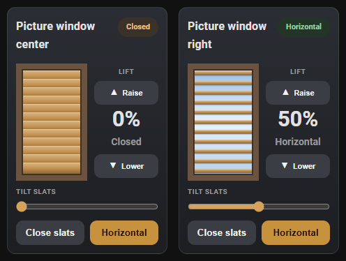
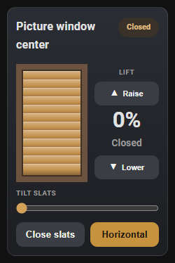
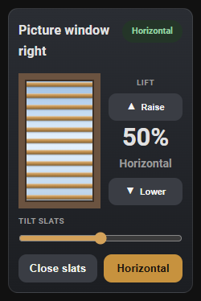
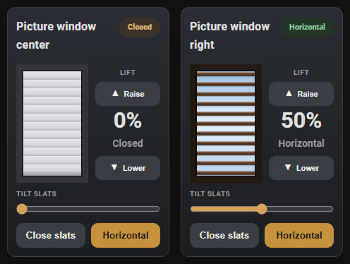

# Venetian Blind Card

[](https://github.com/hacs/integration)
[](https://my.home-assistant.io/redirect/hacs_repository/?owner=randrcomputers&repository=ha-venetian-blind-card&category=plugin)
[](LICENSE)

A Home Assistant Lovelace card for venetian / wood-slat blinds that can **lift** and **tilt**.

- **Lift:** Raise / Lower moves the whole blind up and down.
- **Tilt slats:** Close slats or set them horizontal. The slider does the same thing (0 = closed, 50+ = horizontal).
- **Colors:** Pick slat color and square window-frame color in the visual editor.
- The window graphic follows the **last command**, not a live motor position.

Works with Bond, Z-Wave, Zigbee, or any cover that supports `cover.open_cover`, `cover.close_cover`, and `cover.open_cover_tilt`.



| Closed slats | Horizontal slats |
| :---: | :---: |
|  |  |

Slat and frame colors are optional. Defaults are oak slats and a brown frame:



## What you need for each blind

The card does **not** talk to the cover alone. One-way motors (Bond RF, many IR remotes) cannot report slat angle, so Home Assistant needs two helpers to remember what you last asked for:

| Helper | Domain | Required | What the card uses it for |
| --- | --- | --- | --- |
| Tilt slider | `input_number` | **Yes** | 0–100 position. This is the `entity` field. |
| Last command | `input_text` | Recommended | Remembers `0` (closed), `100` (horizontal), or `up` (raised). This is `state_entity`. |
| The blind | `cover` | **Yes** to move it | Your existing cover. This is `cover_entity`. |

Create **one `input_number` and one `input_text` per blind**. Then point the card at those plus the cover.

### Create the helpers in the UI

1. Settings → Devices & services → **Helpers** → Create helper
2. **Number** (`input_number`)
   - Name: e.g. `Living room tilt`
   - Min `0`, max `100`, step `1`
   - Unit `%`
   - Display mode: **Slider**
3. **Text** (`input_text`)
   - Name: e.g. `Living room tilt state`
   - Maximum length `16`

Or add the same helpers in YAML (see `examples/helpers.yaml`):

```yaml
input_number:
  living_room_tilt:
    name: Living room tilt
    min: 0
    max: 100
    step: 1
    unit_of_measurement: "%"
    mode: slider
    icon: mdi:blinds-horizontal

input_text:
  living_room_tilt_state:
    name: Living room tilt state
    max: 16
    initial: unknown
```

Reload helpers / restart if you added YAML.

## Install the card

### HACS (recommended)

If HACS is already on your Home Assistant, click this button to open the repository and download it:

[](https://my.home-assistant.io/redirect/hacs_repository/?owner=randrcomputers&repository=ha-venetian-blind-card&category=plugin)

Then **Download**, reload dashboard resources, and hard-refresh the browser (**Ctrl+F5**).

Or add it by hand:

1. HACS → Frontend → ⋮ → Custom repositories
2. Add `https://github.com/randrcomputers/ha-venetian-blind-card` as type **Dashboard** (Lovelace)
3. Download **Venetian Blind Card**
4. Restart Home Assistant, then hard-refresh the browser

### Manual

1. Copy `venetian-blind-card.js` to `/config/www/`
2. [](https://my.home-assistant.io/redirect/lovelace_resources/) → add `/local/venetian-blind-card.js` as a **JavaScript module**
3. Hard-refresh the browser (Ctrl+F5)

## Add the card on a dashboard

1. Edit dashboard → Add card → **By card**
2. Search **Venetian** (it is a custom card, not under Core cards)
3. Use the **visual editor** (or YAML) and fill in:

| Visual editor field | YAML key | Pick |
| --- | --- | --- |
| Name | `name` | Title on the card |
| Subtitle | `subtitle` | Optional line under the title |
| Tilt slider (input_number) | `entity` | The number helper you created |
| Last command (input_text) | `state_entity` | The text helper you created |
| Blind cover | `cover_entity` | The real cover entity |
| Slat color | `slat_color` | Optional RGB/hex color for the slats |
| Window frame color | `frame_color` | Optional RGB/hex color for the square frame |

Do not save the sample `living_room_*` entities unless you actually created those helpers.

```yaml
type: custom:venetian-blind-card
name: Living room
subtitle: Venetian blind
entity: input_number.living_room_tilt
state_entity: input_text.living_room_tilt_state
cover_entity: cover.living_room_blind
slat_color: [196, 146, 79]
frame_color: [107, 83, 64]
```

`custom:bond-tilt-card` still works as an old name for the same card.

## How the controls map

| Control | Home Assistant service |
| --- | --- |
| Raise | `cover.open_cover` |
| Lower | `cover.close_cover` |
| Close slats / slider under 50 | `cover.close_cover` |
| Horizontal / slider 50+ | `cover.open_cover_tilt` |

The graphic is optimistic. If someone uses a wall remote, the card will be wrong until the next command from Home Assistant. You can keep it in sync from sunrise/sunset automations by setting the same `input_number` and `input_text` helpers when those automations run.

## License

MIT
